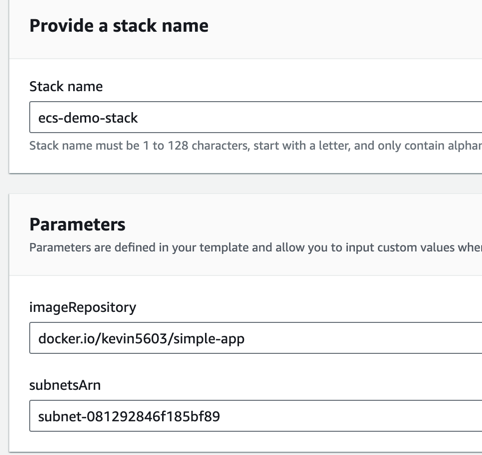
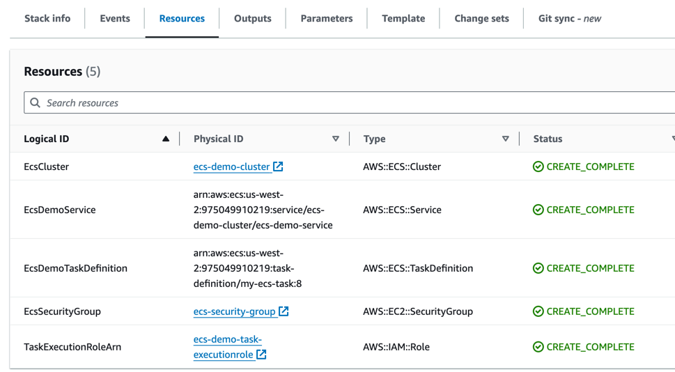
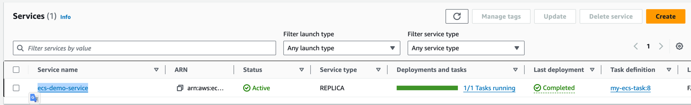
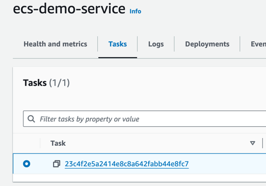
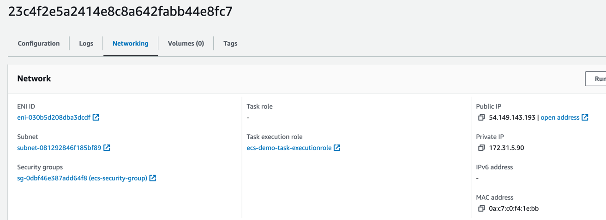
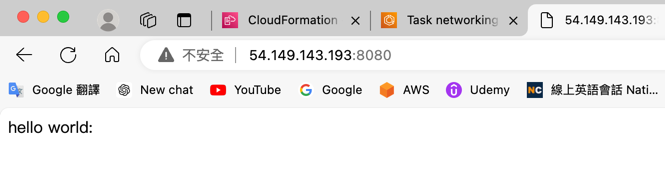

## 打包流程
1.打包jar檔
``` sh
mvn clean package
```
2.打包成image並推到自己的repository
記得把${docker_username}改成自己帳號
！如果有改code記得要重新mvn clean package
``` sh
docker login
docker build -t ${docker_username}/simple-app --platform linux/amd64 . 
docker tag ${docker_username}/simple-app ${docker_username}/simple-app 
docker push ${docker_username}/simple-app
```
檢查 ecs.yml region 是否為自己使用的
`awslogs-region: us-west-2`

3.到aws cloudformation 點選create stack上傳ecs.yml


4.(optional)替換ecs.yml 變數imageRepository改成自己的


5.替換ecs.yml 變數subnetId改成自己的


6.一路點擊next，最後按submit


7.stack創建成功！


8.點選resources可以所創建的resource
並點選ecs-demo-cluster進入ecs console


9.點選ecs-demo-service進入service console


10.點擊tasks tab點選當前的task，我們要來看我們的public ip是多少


11.點選Networking tab查看public IP


12.打上ip加上port8080，如果有顯示畫面則代表起動成功


13.可以到cloudwatch觀察log


14.測試完畢刪除資源，到cloudformation點擊剛創建的stack
點擊delete即可把stack內所有資源刪除


## ECS 可能會用到指令
停止指定task
``` sh
aws ecs stop-task --cluster ${cluster_name} --task ${task_ARN}
```
檢查 custom_params 是否為自己使用的
- awslogs-region
- subnetsArn
- imageRepository (optional)


