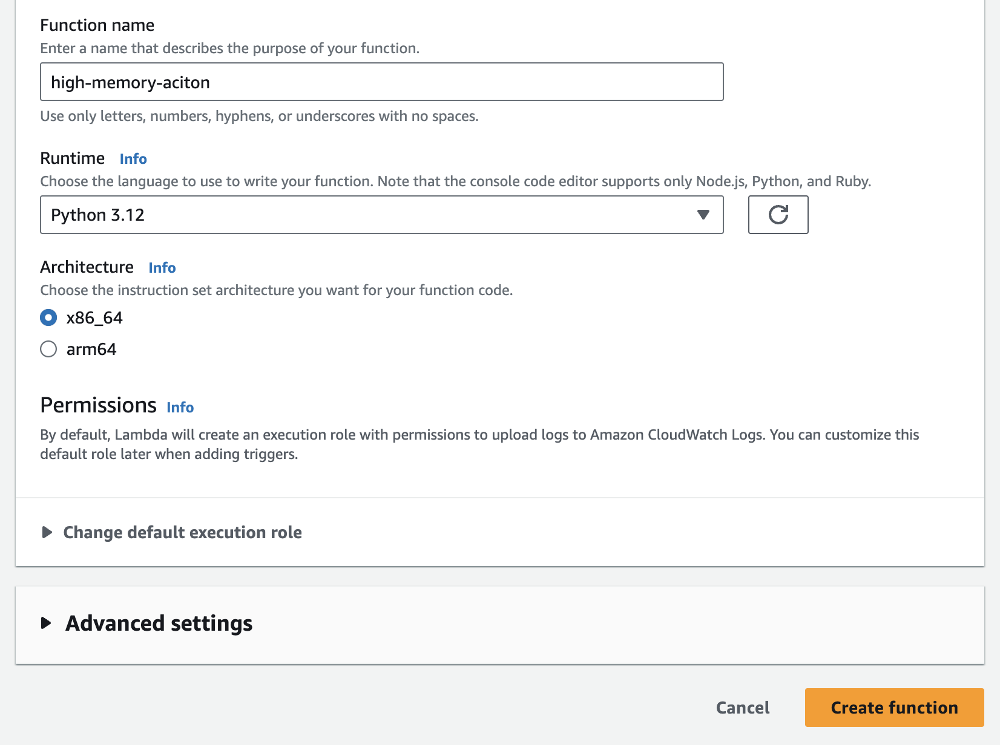
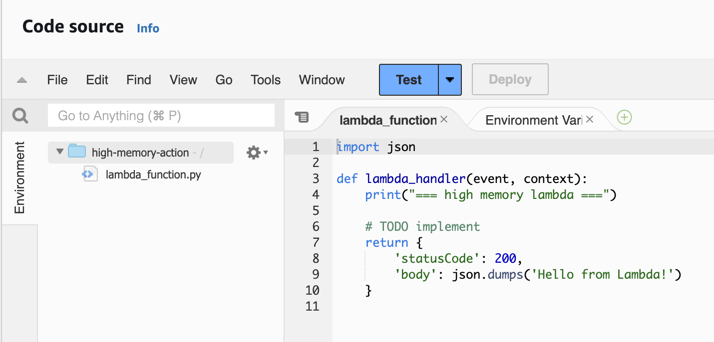
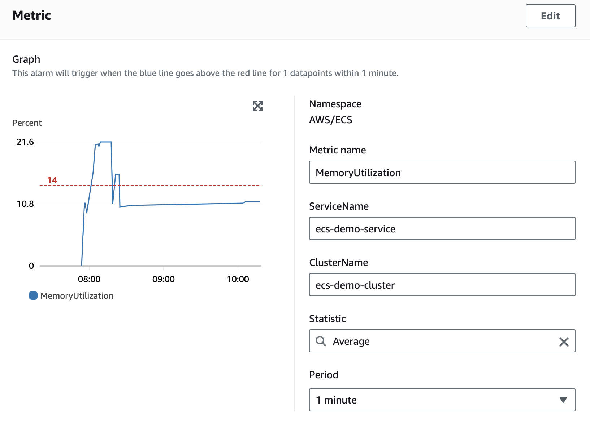
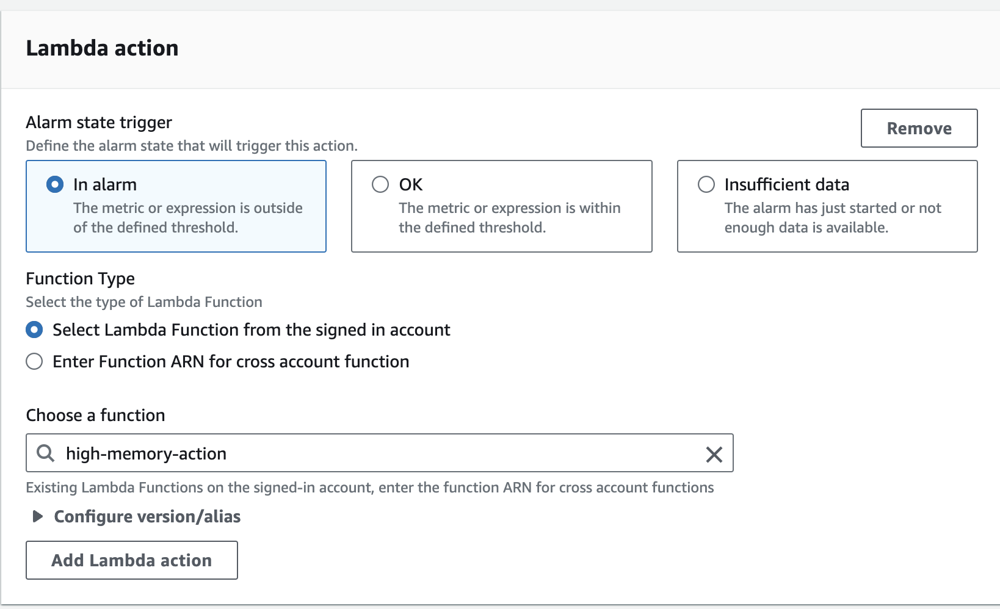
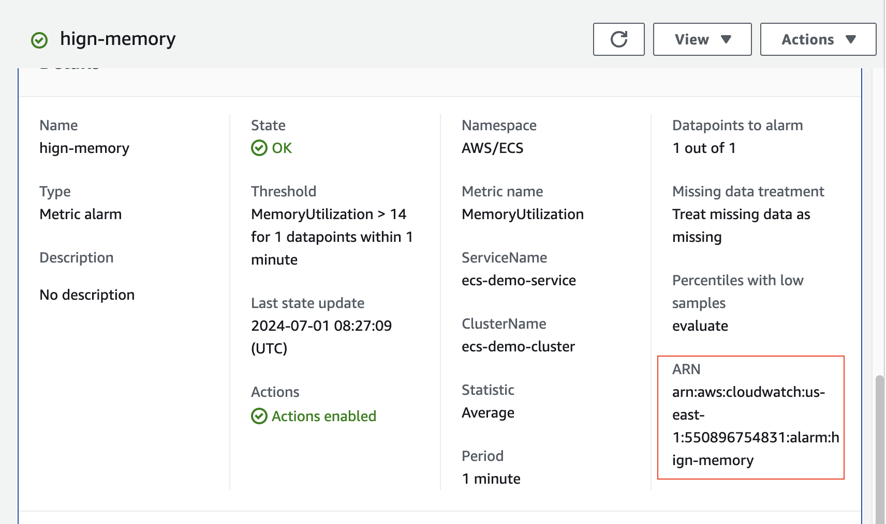
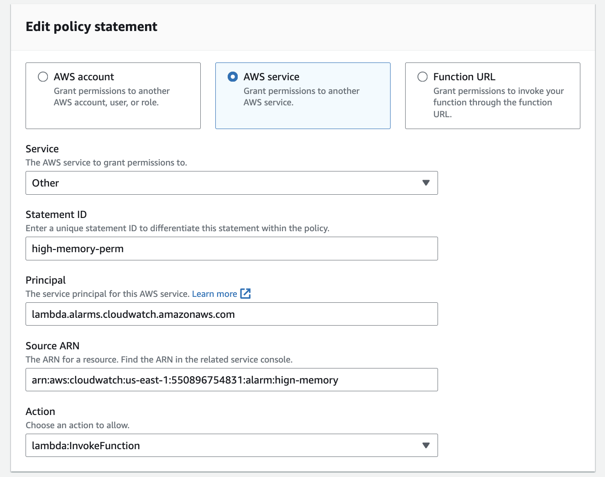
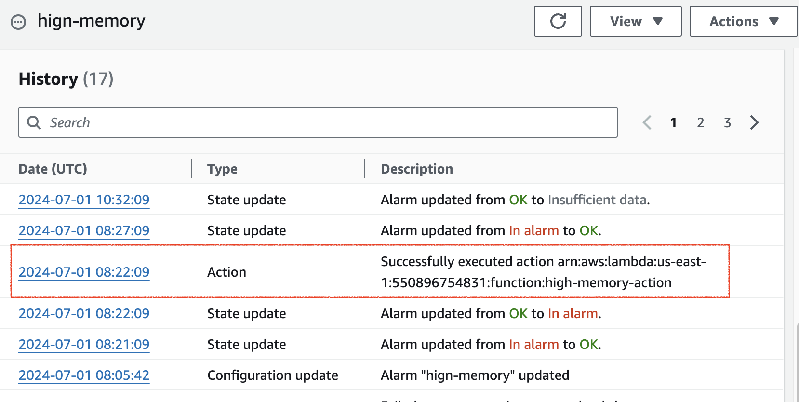
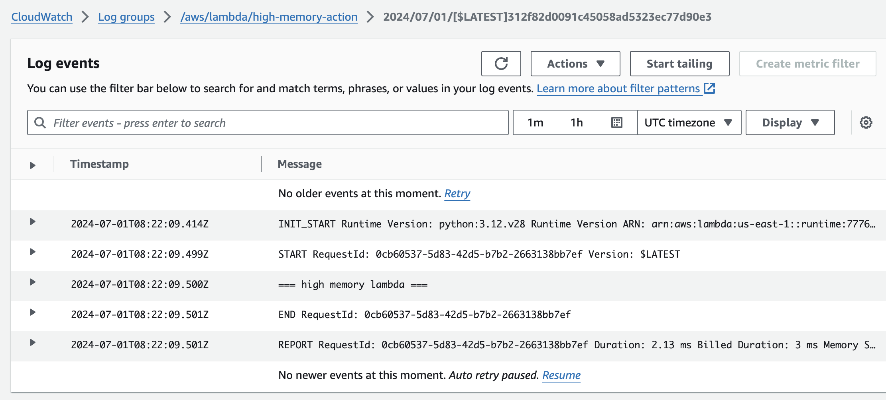

## 注意事項
### 有些aws服務不適用免費方案所以測試完記得要把stack刪掉
## 打包流程
1.打包jar檔
``` sh
mvn clean package
```
2.打包成image並推到自己的repository
記得把${docker_username}改成自己帳號
！如果有改code記得要重新mvn clean package
``` sh
docker login
docker build -t ${docker_username}/simple-app --platform linux/amd64 . 
docker tag ${docker_username}/simple-app ${docker_username}/simple-app 
docker push ${docker_username}/simple-app
```

3.到aws cloudformation 點選create stack上傳ecs.yml


4.(optional)imageRepository改成自己的image


5.ecsDemoVpcId & subnetIdList選擇自己的vpc ＆ subnets


6.一路點擊next，最後按submit


7.stack創建成功！


8.點選resources可以查看stack所創建的resource
並點選EcsDemoLoadbalancer進入alb console


9.複製DNS name這是我們的public domain name


10.如果成功就會看到以下畫面


11.如果當前有多台機器，他會AWSALB來黏住當前session，把它刪掉就可以就有可能會導到不同的機器


12.可以到cloudwatch觀察log


13.可以用/cpu這隻API來測試auto scale


14.測試完畢刪除資源，到cloudformation點擊剛創建的stack
點擊delete即可把stack內所有資源刪除


## 可能會用到指令
停止指定task
``` sh
aws ecs stop-task --cluster ${cluster_name} --task ${task_ARN}
```

~~ECS cluster container insight enabled~~ 請改用cloudformation設定 
``` sh
aws ecs update-cluster-settings --cluster ecs-demo-cluster --settings name=containerInsights,value=enabled
```

Upload file to s3
``` sh
aws s3 cp /Users/kevin.lee/Documents/work/project/demo-gc-metric/lambda/ecs_alarm_handler.py.zip \
s3://kevin5603/ecs_alarm_handler.py.zip
```

Deploy lambda
``` sh
aws lambda update-function-code --function-name ecs_alarm_handler --s3-bucket kevin5603 --s3-key ecs_alarm_handler.py.zip
```

# Create Lambda
## Manually in AWS console
前提：需要將前面的 ECS 建置完畢

1.建立lambda

function name: high-memory-action
Runtime: python: 3.12

其他皆為預設值，點選建立。



2.修改 code source
```
import json

def lambda_handler(event, context):
    print("=== high memory lambda ===")

    # TODO implement
    return {
        'statusCode': 200,
        'body': json.dumps('Hello from Lambda!')
    }
```




2.建立alarm



選擇剛建好的 lambda, 其他保持預設, 一路點下去直至建立 



3.把alarm ARN 複製起來 等等要用



4.回到 lambda 加 permission

Configuration -> Permissions -> Resource-based policy statements -> add permissions



5.memory 超過所設定的閾值便會觸發action




## cloudformation under construction 
